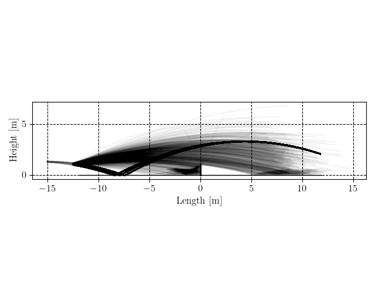

# VR Gaze


Python repository to analyze data from VR experiments. To install the package, open python locally and install the package using the following line in the terminal:
```bash
pip install --upgrade git+https://github.com/vrijeuniversiteit/vrgaze.git
```

## Analyzing tennis data

```python
from vrgaze.tennis import ExperimentalData, BallEvents, GazeEvents, load_condition
from vrgaze.tennis import plot_3d, plot_birdview, plot_side, plot_gaze_ball_angle

experts = load_condition("Experts", "example_data/tennis_data/experimental_condition")
novices = load_condition("Novices", "example_data/tennis_data/experimental_condition")

data = ExperimentalData([experts, novices])

data.process(BallEvents())
data.process(GazeEvents())

plot = plot_gaze_ball_angle(data)
plot.savefig("plot_gaze_ball_angle.png")
plot.show()

plot = plot_3d(data, show_predictive_saccades=True)
plot.savefig("plot_3d.png")
plot.show()

plot = plot_birdview(data)
plot.savefig("plot_birdview.png")
plot.show()

plot_side(data)
plot.savefig("plot_side.png")
plot.show()

data.to_csv("example_results.csv")
```

## Examples



