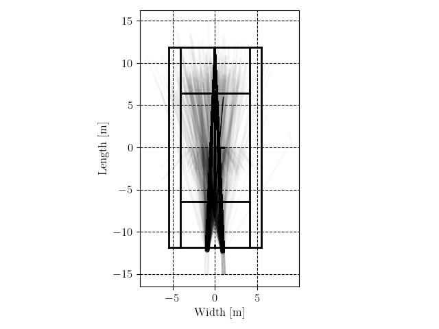

# VR Gaze


Python repository to analyze data from VR experiments. Three steps are required to install the package:

1. Install Python (3.6 or higher)
2. Install an IDE (e.g. Visual studio code, PyCharm, Jupyter notebook, Spyder)
3. Open the IDE in a folder of your choice. This is your root project folder.
4. Place a script `main.py` inside of the root folder 
5. Install the `vrgaze` package using pip (below) If you are in an IDE, open a terminal and type the following commands:
```bash
pip install --upgrade git+https://github.com/vrijeuniversiteit/vrgaze.git
```

## Analyzing tennis data
```python
--8<-- "tennis.py"
```

## Examples



