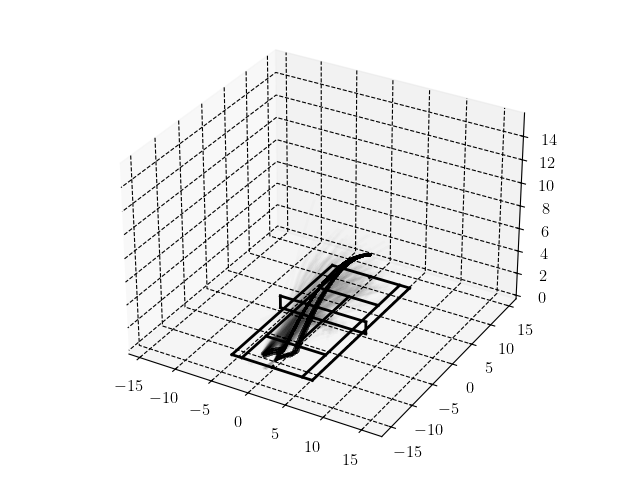
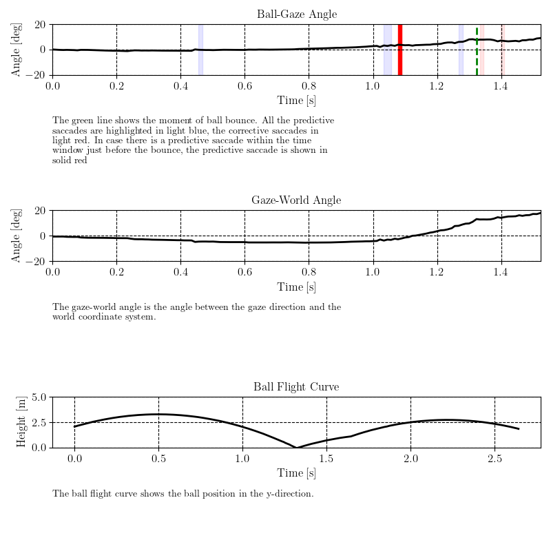

# VR Gaze




Python repository to analyze data from VR experiments. To install the package, open python locally and install the package using the following line in the terminal:
```bash
pip install --upgrade git+https://github.com/vrijeuniversiteit/vrgaze.git
```

## Analyzing tennis data

```python
--8<-- "../tennis.py"
```

## Examples



